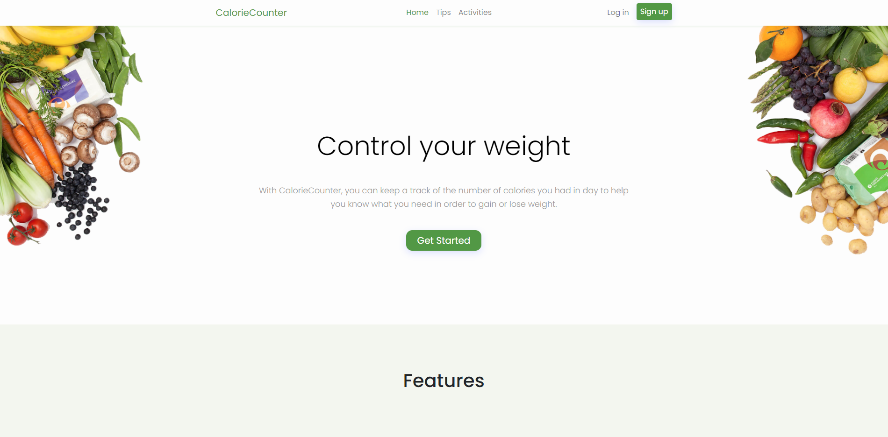
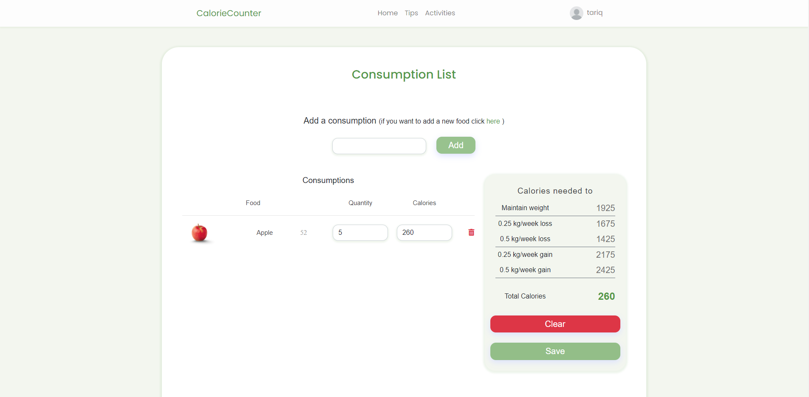

# CalorieCounter

## Description

CalorieCounter is a MERN stack application that can help you manage the number of calories you take a day in order to maintain a healthier diet (The project is still in progress so more features will be added in the future).

## Technologies used

React - Redux - Express - MongoDB - Bootstrap 5 - Sass

<div></div>

<div></div>

**Live preview:** [CalorieCounter](https://g-calorie-counter.herokuapp.com/)

## Installing dependencies

This postinstall script (which would install both dependencies for the backend and frontend) for this project uses yarn, so you should install yarn globally first if you don't have it already.

```sh
npm i -g yarn
```

Then you can simply install the dependencies using the command "yarn" in the root folder

```sh
yarn
```

